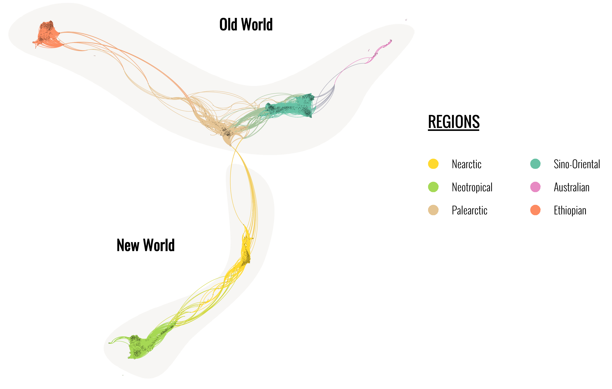

biogeonetworks is an R package that implements several functions to write, read 
and analyse biogeographical networks. It is primarily designed to work with the
Map Equation algorithm (infomap) and with the [Gephi visualisation software.](gephi.org)

I did not plan to release at all this package or write this guide. However, 
given that many people have asked me for help in performing biogeographical 
network, I have decided to release the package on GitHub (I do not have plans
for a CRAN release now) and write a free tutorial for it. 

If you are not familiar with biogeographical, I highly recommend that you first
read the introductory paper by [Vilhena & Antonelli2015](https://www.nature.com/articles/ncomms7848), the comparative
paper of [Bloomfield et al. 2018](https://onlinelibrary.wiley.com/doi/full/10.1111/ecog.02596), and finally
[the paper on the global biogeography of freshwater fishes](https://www.biorxiv.org/content/10.1101/319566v3) which I will
use as an example here.


*Note that we do not use the network/graph packages in R such as `igraph` here, as 
our networks are handled in a `data.frame` format in R, and exported to other 
software in specific network formats such as Pajek or GDF formats. However, 
conversion from and to `igraph` objects are possible.*

# 1. Requirements 

## 1.1. The biogeonetworks package 

Install the most recent version from GitHub:
``` {r install, eval = FALSE}
install.packages("devtools")
devtools::install_github("Farewe/biogeonetworks")
```


Install the following packages (required to run the examples)
```{r required, eval = FALSE}
install.packages(c("rgdal", "plyr", "RColorBrewer", "sp", "tmap"))
```

## 1.2. Example database

Our example dataset will be the global database of freshwater fish species
occurrences as we used it in the paper on [global biogeographical regions of 
freshwater fish species](https://www.biorxiv.org/content/10.1101/319566v3).

[You can download the example dataset from here](https://www.biorxiv.org/content/biorxiv/early/2019/06/12/319566/DC1/embed/media-1.csv?download=true)

Load it in R as follows:

```{r dlfile, eval = TRUE, cache = TRUE}
download.file("https://www.biorxiv.org/content/biorxiv/early/2019/06/12/319566/DC1/embed/media-1.csv",
              destfile = "fish.csv", mode = "wb")
fish = read.csv("fish.csv")
head(fish)
```

Let's also get the shapefiles of basins so we can make maps.
The shapefile is large so making the map may take a while.
```{r dlfile2, eval = TRUE, cache = TRUE}
library(rgdal)
download.file("https://borisleroy.com/permanent/basinshapefile.RDS",
              destfile = "basinshapefile.RDS", mode = "wb")
basins <- readRDS("basinshapefile.RDS")
plot(basins)
```

## 1.3. Map Equation software

If you want to run Map Equation, you need to download the source code from the
[Map Equation website and compile the file](https://www.mapequation.org/code.html).

In case you are not sure how to do that and/or do not manage to compile the
code, I provide the executable I used for the biogeography paper at the following
URL: https://borisleroy.com/permanent/Infomap.exe 

This version corresponds to the version we used in the paper, i.e. infomap 
0.19.12, released 27 Oct. 2017.

However, I highly recommend that you compile yourself the last version of infomap
if you plan to use it for research. Also, if you work on a mac, you will have to
compile the code yourself as I cannot compile for macs!

Put the Map Equation software in a directory where you know the full path; for 
me it is at the root of my R folder.


# 2. Biogeographical network analysis

## Overview of the procedure

* **Step 1.** Prepare your dataset as a bipartite `data.frame`, i.e. a `data.frame`
composed of two columns: sites and species. Each row represents a species 
occurring in a site. You can also add a third column representing species 
abundances or frequencies of occurrences: Map Equation also works very well with
species abundances. 

| Sites      | Species      | Abundance (facultative)  | 
|------------|--------------|-------------------------:|
| A          | Sp 1         | 10                       |
| A          | Sp 2         | 15                       |
| A          | Sp 3         | 3                        |
| B          | Sp 1         | 1                        |
| B          | Sp 4         | 12                       |

* **Step 2.** Write the network in Pajek format.
* **Step 3.** Run the Map Equation Algorithm on the Pajek network.
* **Step 4.** Read the output of Map Equation back into R as a `data.frame`.
* **Step 5.** Analyse the network in R.
* **Step 6.** Make maps.
* **Step 7.** Write the network in GDF format for analysis in Gephi.


Now, because our example network is already in the correct format, we will skip
to Step 2.

## Step 1. Prepare the bipartite `data.frame`

Our example is already in this format. 

**Important**: make sure that both your species and site columns are `factors`.

## Step 2. Write the network in Pajek format

The Pajek format is a network file format that can be read by the Map Equation
algorithm. We use the function `writePajek` to do that.

``` {r writepajek, eval = TRUE, cache = TRUE}
library(biogeonetworks)
writePajek(fish, 
           site.field = "X1.Basin.Name", # Name of your site column
           species.field = "X6.Fishbase.Valid.Species.Name", # Name of your species column
           filename = "fish.net", # Name of the output file
           abundance.field = NULL) # (FACULTATIVE) Name of abundance column
``` 

A file called "fish.net" should have appeared in your working directory. Note 
that if you wish, you can already open this file in Gephi to start exploring 
your network.

**If you have any errors at this stage please verify the spelling of your columns, 
and that they are in `factor` format.**

## Step 3. Run the Map Equation algorithm

We will now run the Map Equation algorithm, which is an executable file outside
R. To do that, we use the `system()` function which allows to run software in
command line format. 

Map Equation allows a variety of options and I won't describe them here. All the
details are provided [on the Map Equation website](https://www.mapequation.org/code.html).

Below are the parameters we specified for our fish biogeography paper:

* `--undirected`: means that the network is not directed (i.e., no arrows)

* `-N 1000`: number of runs set to 100. The Map Equation is based on a stochastic
 process, so you need to set a high number of runs to find a stable solution. In 
 our experience, 100 runs always yielded the same resuts - but it may differ for 
 other datasets.

* `--tree`: output file format ".tree". We will use this format in step 4.

* `--map`: output file format ".map". Useful if you want to [use the apps on 
 the Map Equation website](https://www.mapequation.org/apps.html), as these are reading .map file formats.
 
After the parameters are set, you specify the input file (Pajek file generated at
step 2), and then the output folder.

*Note here that mac users may need to adjust the last part of this command line,
as paths are not written the same as in windows.*


``` {r mapequation, eval = TRUE, cache = TRUE, echo = TRUE, results = "hide"}
system("infomap --undirected --tree --map -N 1000 fish.net ./")
```

Infomap is very talkative and your console is now filled with information and 
numbers. It's not extremely important to be able to read it at this point as 
we will be analysing everything on our own later on. Nevertheless, the last 
synthesis of infomap (shown below) informs you that it found a solution in six levels; i.e.
there is a hierarchy of nested clusters with up to six levels. In my case it
indicates that it found 16 clusters at the first level, 16 clusters and 32 leaf 
nodes (leaf nodes are always sites or species) at the second, etc.
However, not all clusters found at each level are important - as we will see
later, some clusters at the first level are simply composed of isolated basins
with a few endemic species.

```
Best end modular solution in 6 levels:
Per level number of modules:         [         16,          16,          89,          96,          16,           0] (sum: 233)
Per level number of leaf nodes:      [          0,          32,          57,        8620,        4057,        1110] (sum: 13876)
Per level average child degree:      [         16,           3,       9.125,     97.9326,     42.4271,      69.375] (average: 78.327621725)
Per level codelength for modules:    [0.000690550, 0.022845259, 0.530561333, 0.373025892, 0.092733170, 0.000000000] (sum: 1.019856203)
Per level codelength for leaf nodes: [0.000000000, 0.000625408, 0.003806125, 3.726011192, 2.747859945, 0.713083216] (sum: 7.191385886)
Per level codelength total:          [0.000690550, 0.023470667, 0.534367457, 4.099037084, 2.840593114, 0.713083216] (sum: 8.211242089)
```


If you look into your hard drive, your should see that two new files have been
written by Map Equation, called "fish.tree" and "fish.map".

**If you have any errors at this step, please verify carefully your `system()` 
command, and check that you did not make any mistake in your file / path names.**

## Step 4. Read Map Equation results in R

We read the "fish.tree" file in R with the function `readInfomapTree()`.

```{r readinfomaptree, cache = TRUE}
fish.clusters <- readInfomapTree("fish.tree",
      network.summary = TRUE, # Prints a summary of the clustering results
      replace.leaf.names = TRUE) # Changes node numbers to actual names for terminal nodes (i.e. site & species names)
```

Let's inspect the generated object:

```{r readtree2, cache = TRUE}
head(fish.clusters)
```

In this table, each row corresponds to one node (i.e., one site or one species) 
of the network. The columns provide information for each node:

* `Groups`: clusters as defined by Map Equation. We won't use this column as
clusters are provided in more details in other columns.

* `Codelength`: quantitative information that Map Equation used to produce 
clusters.

* `Name`: node name (i.e., site or species name)

* `id`: node id in the network

* `lvl1`, `lvl2` and so on: each column correspond to one level of the 
hierarchical clustering of Map Equation. Here we have six columns corresponding
to the six levels of our hierarchical clustering. `lvl1` correspond to coarser,
more global clusters, whereas `lvl6` correspond to the finer level and is only
composed of leaf nodes (no more clusters, only species or site names).

At the first level, cluster are name as `1`, `2`, `3`, `4`, etc. 
Second level clusters are nested in first level clusters, so they are indicated 
as, for example, `2.3`, to indicate that we looking at the 3rd subcluster inside
the cluster 2 of level 1. Likewise, third level clusters are indicated as e.g.
`2.3.1`, meaning cluster 2, subcluster 3, subsubcluster 1. This hierarchy goes
on until the last level where you will always have a species or site name.

This notation is designed to ensure that you do not confuse sublevel clusters,
for example confuse subcluster 1 of cluster 2 with subcluster 1 of cluster 1.

Once you are familiarised with how clusters are coded, we can proceed and start
analysing our results - we are mostly interested in what's in columns `lvl1`
to `lvl6`.


## Step 5. Analysing biogeographical network & clustering results in R

Foremost, we are looking for several information to grasp our clustering results:
How many clusters there are? Are they all significant - i.e. how many species 
there are per cluster? How many sites per cluster? How many clusters at level 2?

Let's start with the numbers of clusters at level 1 and level 2:
```{r analysis1, cache=TRUE}
levels(fish.clusters$lvl1)
levels(fish.clusters$lvl2)
```

We can see that at level 1 we have 16 clusters. At level 2 we have again 16 
clusters, and a variety of species and site nodes. By looking at the names of
level 2 clusters, we can figure out that only clusters 1 to 5 of level 1 have 
a nested hierarchy of subclusters.

If we look at our `fish.clusters` table, both species and site nodes are mixed
together in the table and it seems difficult to disentangle the results from
them. Let's look at how many nodes are inside each cluster at **level 1**:

```{r analysis2, cache=TRUE}
plyr::count(fish.clusters$lvl1)
```

We can see that clusters 1 and 2 respectively have 7567 and 6220 nodes, whereas 
clusters 3 to 16 have less than 26 nodes each. Therefore, we can assume that 
the only significant clusters at this stage are clusters 1 and 2 - but we still 
neither know how many species they have each, nor how many sites. We will 
therefore split our network table into two tables: one for sites and one for 
species.

First, let's make a table composed only of site nodes:

```{r analysis3, cache=TRUE}
fish.sites <- getSiteTable(fish, # Your bipartite data.frame of STEP 1
   site.field = "X1.Basin.Name", # Name of your site column
   network = fish.clusters) # Output table from Map Equation

plyr::count(fish.sites$lvl1)
```

We can see that we clearly have two major clusters, clusters `1` and `2`, which
respectively have 1888 and 644 sites. The other clusters are much more marginal
here.

Let's look at the species table now:
```{r analysis4, cache=TRUE}
fish.species <- getSpeciesTable(fish, # Your bipartite data.frame of STEP 1
   species.field = "X6.Fishbase.Valid.Species.Name", # Name of your species column
   network = fish.clusters) # Output table from Map Equation

plyr::count(fish.species$lvl1)
```

We see here that our first two clusters both have more than 5500 species, 
whereas most other clusters only have a few species. 

Therefore, overall, we consider that there are two major clusters at level 1, 
and a few minor additional clusters.

If we now investigate **level 2**:
```{r analysis5, cache=TRUE}
plyr::count(fish.sites$lvl2)
plyr::count(fish.species$lvl2)
```

We have six majors clusters at the second level, which all have more than 250 
sites. Their species richness varies from 78 to 4750.

All the other clusters have less than 10 species and only a few basins so we 
will focus on the following cluster:
* **level 1**: clusters `1` and `2`
* **level 2**: clusters `1.1`, `1.2`, `1.3`, `1.4`, `2.1` and `2.1`

Once we have decided our number of clusters, our next step will be useful for 
both the network visualisation and map making: we will define the colours
for each cluster. Contrary to what it may seem, **this step is absolutely not 
straightforward** and may generate a lot of confusion, which is why I wrote a 
function to automatically assign colours based on the chosen number of significant
clusters. This function uses the package RColorBrewer and therefore will assign
colours based on [RColorBrewer palettes](colorbrewer2.org). There can be no more 
than 12 colours on these colour palettes, therefore if you have more than 12
significant clusters, you can ask the function to assign shades of grey to the 
other clusters using the argument `sh.grey = TRUE`. Finally, all the "minor"
clusters will have the same colour which you can define with the argument
`other.color`.

First we assign colours to the level 1 clusters; notice how the function simply
adds a column to the Map Equation `data.frame`, therefore you should always 
assign the result of the function to this same `data.frame`.

```{r color1, cache=TRUE}
fish.clusters <- attributeColors(network = fish.clusters, # Same object as input & output
    lvl = "lvl1", # Which hierarchical level are we working on?
    nb.max.colors = 2, # We chose two clusters as significant for level 1
    colname = "colors.lvl1", # Name to give to the colour column
    other.color = "black", # Minor clusters will be black
    cluster.order = "sites", # Cluster order for colours (see below)
    db = fish, # Database of step 1
    site.field = "X1.Basin.Name", # Name of site column in your database
    species.field = "X6.Fishbase.Valid.Species.Name") # Name of species column in your database
head(fish.clusters)
```

As you can see, a column called `colors.lvl1` was added to our `fish.clusters` 
object, and it contains hexadecimal colour codes. We will use these codes later
to make maps and colour clusters in Gephi.

About the `cluster.order` argument: this argument is important to determine the
"significant" clusters that will receive colours. In my case, I used the number
of sites to determine the important clusters. Therefore, at level 1 I want the
two clusters with the highest number of sites to be coloured. Likewise, at level
2 I want the six clusters with the highest number of sites to be coloured. 

Different options are available:

* `cluster.order = "undefined"`: the order of clusters is based on the order of
factor levels for the cluster column 

* `cluster.order = "sites"`: the order of clusters is based on the decreasing
number of sites per cluster

* `cluster.order = "species"`: the order of clusters is based on the decreasing
number of species per cluster

* `cluster.order = "sites+species"`: the order of clusters is based on the total
number of nodes (sites & species) per cluster


Before we proceed with the maps, let's also add a colour column for the level 2 
of our analyses:
```{r color2, cache=TRUE}
fish.clusters <- attributeColors(network = fish.clusters, # Same object as input & output
    lvl = "lvl2", # Which hierarchical level are we working on?
    nb.max.colors = 6, # We chose two clusters as significant for level 2
    colname = "colors.lvl2", # Name to give to the colour column
    other.color = "black", # Minor clusters will be black
    cluster.order = "sites", # Cluster order for colours (see below)
    db = fish, # Database of step 1
    site.field = "X1.Basin.Name", # Name of site column in your database
    species.field = "X6.Fishbase.Valid.Species.Name") # Name of species column in your database
head(fish.clusters)
```


## Step 6. Make maps

The simplest way to map our clusters with vector data is to add the colour 
columns the dataframe of our polygon data. Whether you work with sp or sf does 
not matter as the procedure will be the same; here I will make the exampe with 
sp.

First, add colour columns to the `data` slot of our `basins` polygons. We need 
to make sure that each basins gets its proper colour, so we use the `match()`
function to do that. Of course, to do that, you need to make sure that the names
between your polygons and your step 1 `data.frame` are exactly the same.


```{r polygons1, cache=TRUE}
basins@data$colors.lvl1 <- fish.clusters$colors.lvl1[match(
  basins@data$BasinName, fish.clusters$Name
)]
head(basins@data)
```

Now making the map is relatively straightforward:
```{r polygons2, cache=TRUE}
plot(basins, col = basins@data$colors.lvl1)
```

It becomes clear now that these two big clusters at level 1 are the 
supercontinental regions we described in our paper. Let's add a legend to that:

```{r polygons3, cache=TRUE}
bioregions.lvl1 <- unique(fish.clusters[, c("lvl1", "colors.lvl1")])
bioregions.lvl1 <- bioregions.lvl1[-which(duplicated(bioregions.lvl1$colors.lvl1)), ]
bioregions.lvl1$Regions <- c("New World", "Old World", "Small clusters")

plot(basins, col = basins@data$colors.lvl1)
legend("bottomleft",
       fill = bioregions.lvl1$colors.lvl1,
       legend = bioregions.lvl1$Regions)
```

Let's do this for level 2 now:


```{r polygons4, cache=TRUE}
basins@data$colors.lvl2 <- fish.clusters$colors.lvl2[match(
  basins@data$BasinName, fish.clusters$Name
)]

bioregions.lvl2 <- unique(fish.clusters[, c("lvl2", "colors.lvl2")])
bioregions.lvl2 <- bioregions.lvl2[-which(duplicated(bioregions.lvl2$colors.lvl2)), ]
bioregions.lvl2$Regions <- c("Sino-Oriental",
                             "Ethiopian",
                             "Palearctic",
                             "Australian",
                             "Neotropical",
                             "Nearctic",
                             "Small clusters")

plot(basins, col = basins@data$colors.lvl2)
legend("bottomleft",
       fill = bioregions.lvl2$colors.lvl2,
       legend = bioregions.lvl2$Regions)
```


## Step 7. Write the network for visualisation in Gephi

If you want to explore the structure of your network in [Gephi](gephi.org), you 
can write the network on the hard drive with the function `writeGDF`. The major
asset of this function over the function used in step 2 is that the GDF file 
format can take into account additional columns, such as colour column. If you
provide a colour column, Gephi will automatically colour your nodes according to 
this column.

```{r gdf, cache=TRUE}
writeGDF(db = fish, # Database of step 1
    site.field = "X1.Basin.Name", # Name of site column in your database
    species.field = "X6.Fishbase.Valid.Species.Name", # Name of species column in your database
    network = fish.clusters, 
    filename = "fish.gdf",
    color.field = "colors.lvl2") # Name of the color field in the network

```

Notice how I chose to colour nodes according to the second level here.

After that, you are free to experiment with your network in Gephi, and find
your ideal visualisation! It takes a while to find your optimal set of colours
and spatialisation algorithm, but you can get some neat results in the end.

This is what we ended up with:

```{r gdf2, echo=FALSE, out.width = '100%'}

```


I highly recommend you to learn to explore networks as they are very useful to
understand patterns or discover errors in your datasets (e.g., strange links
between regions may indicate records of introduced species!).

# Calculation of the Participation Coefficient

The Participation Coefficient, introduced by [Bloomfield et al. 2018](https://onlinelibrary.wiley.com/doi/full/10.1111/ecog.02596),
provides an indication of the degree to which a node is sharing links with nodes
of other clusters. In other words, for a site, it indicates whether the site has
a lot of species from other regions; for a species, it indicates the degree to
which this species occurs in other regions. 

This is a very useful metric to highlight transition zones in biogeography.

Let's make an example with the Participation coefficient calculated at level 2
of our network. Depending on the size of your network, the calculation may take
a little while.


```{r pc1, cache=TRUE}
library(plyr)
fish.clusters <- participationCoefficient(
  network = fish.clusters, # Map Equation clustering results
  db = fish, # Database of step 1
  site.field = "X1.Basin.Name", # Name of site column in your database
  species.field = "X6.Fishbase.Valid.Species.Name", # Name of species column in your database 
  lvl = "lvl2") 

head(fish.clusters)
```

Now let's make a map of our participation coefficient; for this map I will use
both the tmap packages, as it makes beautiful maps really easily.

```{r pc2, cache=TRUE}

basins@data$PC <- fish.clusters$participation.coef[match(
  basins@data$BasinName, fish.clusters$Name
)]

library(tmap)

tm_shape(basins) +
 tm_polygons("PC")
```

And here is the transition zones maps! The differences between the results here
and those in our paper correspond to the *post-hoc* changes we made to the minor
clusters (see Appendix S5).


# Another example with raster data

I still have to write this section!

# Credits
Package and tutorial written by Boris Leroy, Lab. BOREA, Muséum National
d'Histoire Naturelle, Paris, France

Citations:

* Leroy B, Dias MS, Giraud E, Hugueny B, Jézéquel C, Leprieur F, Oberdorff T, Tedesco PA. 2019. Global biogeographical regions of freshwater fishes. *Journal of Biogeography*

* Leroy B. 2019. biogeonetworks: Biogeographical Network Manipulation And Analysis, R package version 0.1.1, https://github.com/Farewe/biogeonetworks

