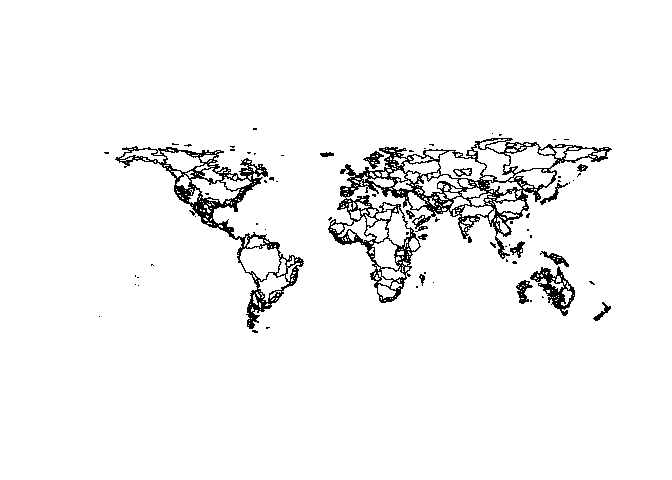

biogeonetworks is an R package that implements several functions to write, read 
and analyse biogeographical networks. It is primarily designed to work with the
Map Equation algorithm (infomap) and with the Gephi visualisation software.

Note that we do not use the network/graph packages in R such as `igraph` here, as 
our networks are handled in a `data.frame` format in R, and exported to other 
software in specific network formats such as Pajek or GDF formats.

# 1. Requirements 

## 1.1. The biogeonetworks package 

Install the most recent version from GitHub:

```r
install.packages("devtools")
devtools::install_github("Farewe/biogeonetworks")
```


Install the following packages (required to run the examples)

```r
install.packages("rgdal")
```

## 1.2. Example database

Our example dataset will be the global database of freshwater fish species
occurrences as we used it in the paper on [global biogeographical regions of 
freshwater fish species](https://www.biorxiv.org/content/10.1101/319566v3).

[You can download the example dataset from here](https://www.biorxiv.org/content/biorxiv/early/2019/06/12/319566/DC1/embed/media-1.csv?download=true)

Load it in R as follows:


```r
download.file("https://www.biorxiv.org/content/biorxiv/early/2019/06/12/319566/DC1/embed/media-1.csv",
              destfile = "fish.csv", mode = "wb")
fish = read.csv("fish.csv")
head(fish)
```

```
##   X1.Basin.Name X6.Fishbase.Valid.Species.Name
## 1            Aa                  Abramis brama
## 2            Aa              Alburnus alburnus
## 3            Aa            Barbatula barbatula
## 4            Aa                Blicca bjoerkna
## 5            Aa                 Cobitis taenia
## 6            Aa                    Esox lucius
```

Let's also get the shapefiles of basins so we can make maps.
The shapefile is large so making the map may take a while.

```r
library(rgdal)
download.file("https://borisleroy.com/permanent/basinshapefile.RDS",
              destfile = "basinshapefile.RDS", mode = "wb")
basins <- readRDS("basinshapefile.RDS")
plot(basins)
```

<!-- -->

## 1.3. Map Equation software

If you want to run Map Equation, you need to download the source code from the
[Map Equation website and compile the file](https://www.mapequation.org/code.html).

In case you are not sure how to do that and/or do not manage to compile the
code, I provide the executable I used for the biogeography paper at the following
URL: https://borisleroy.com/permanent/Infomap.exe 

This version corresponds to the version we used in the paper, i.e. infomap 
0.19.12, released 27 Oct. 2017.

However, I highly recommend that you compile yourself the last version of infomap
if you plan to use it for research. Also, if you work on a mac, you will have to
compile the code yourself as I cannot compile for macs!

Put the Map Equation software in a directory where you know the full path; for 
me it is at the root of my R folder.


# 2. Making the biogeographical network

## 2.1. Overview of the procedure

* *Step 1.* Prepare your dataset as a bipartite `data.frame`, i.e. a `data.frame`
composed of two columns: sites and species. Each row represents a species 
occurring in a site. You can also add a third column representing species 
abundances or frequencies of occurrences: Map Equation also works very well with
species abundances. 

| Sites      | Species      | Abundance (facultative)  | 
|------------|--------------|-------------------------:|
| A          | Sp 1         | 10                       |
| A          | Sp 2         | 15                       |
| A          | Sp 3         | 3                        |
| B          | Sp 1         | 1                        |
| B          | Sp 4         | 12                       |

* *Step 2.* 


