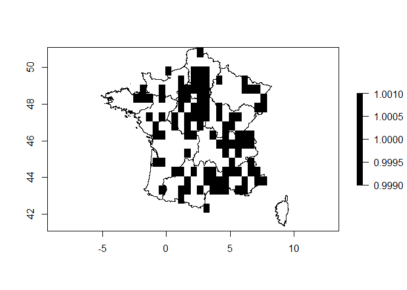
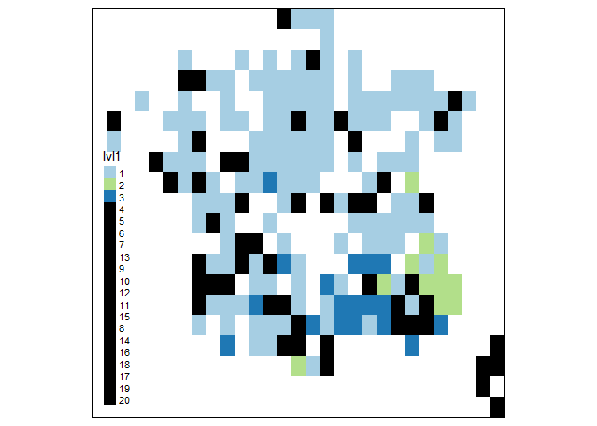

Biogeographical networks in R
================

  - [Requirements](#requirements)
      - [The biogeonetworks package](#the-biogeonetworks-package)
      - [Example database](#example-database)
      - [Map Equation software](#map-equation-software)
      - [The Gephi network visualisation
        software](#the-gephi-network-visualisation-software)
  - [Biogeographical network analysis: a detailed
    tutorial](#biogeographical-network-analysis-a-detailed-tutorial)
      - [Overview of the procedure](#overview-of-the-procedure)
      - [Step 1 Prepare the bipartite
        dataframe](#step-1-prepare-the-bipartite-dataframe)
      - [Step 2 Write the network in Pajek
        format](#step-2-write-the-network-in-pajek-format)
      - [Step 3 Run the Map Equation
        algorithm](#step-3-run-the-map-equation-algorithm)
      - [Step 4 Read Map Equation results in
        R](#step-4-read-map-equation-results-in-r)
      - [Step 5 Analysing biogeographical network & clustering results
        in
        R](#step-5-analysing-biogeographical-network-clustering-results-in-r)
      - [Step 6 Make maps](#step-6-make-maps)
      - [Step 7 Write the network for visualisation in
        Gephi](#step-7-write-the-network-for-visualisation-in-gephi)
      - [Calculation of the Participation
        Coefficient](#calculation-of-the-participation-coefficient)
  - [Biogeographical networks, a second example with raster
    maps](#biogeographical-networks-a-second-example-with-raster-maps)
      - [Get occurrence data points and transform them into
        rasters](#get-occurrence-data-points-and-transform-them-into-rasters)
      - [Step 1 Prepare the bipartite
        dataframe](#step-1-prepare-the-bipartite-dataframe-1)
      - [Step 2 Write the network in Pajek
        format](#step-2-write-the-network-in-pajek-format-1)
      - [Step 3 Run the Map Equation
        algorithm](#step-3-run-the-map-equation-algorithm-1)
      - [Step 4 Read Map Equation clusters in
        R](#step-4-read-map-equation-clusters-in-r)
      - [Step 5 Analysing the results in
        R](#step-5-analysing-the-results-in-r)
      - [Step 6 Make raster maps\!](#step-6-make-raster-maps)
  - [Credits](#credits)

biogeonetworks is an R package that implements several functions to
write, read and analyse biogeographical networks. It is primarily
designed to work with the Map Equation algorithm (infomap) and with the
[Gephi visualisation software.](gephi.org)

I did not plan to release at all this package or write this guide.
However, given that many people have asked me for help in performing
biogeographical network, I have decided to release the package on GitHub
(I do not have plans for a CRAN release now) and write a free tutorial
for it. **Warning: Since I initially did not intend to release this
package publicly, I did not develop meaningful error messages for the
possible mistakes that users can make when using these functions. If you
struggle really hard, you may write me an e-mail to get help: be concise
and include all the necessary information.**

If you are not familiar with biogeographical, I highly recommend that
you first read the introductory paper by [Vilhena &
Antonelli 2015](https://www.nature.com/articles/ncomms7848), the
comparative paper of [Bloomfield et
al. 2018](https://onlinelibrary.wiley.com/doi/full/10.1111/ecog.02596),
and finally [the paper on the global biogeography of freshwater
fishes](https://onlinelibrary.wiley.com/doi/abs/10.1111/jbi.13674) which
I will use as an example here.

*Note that we do not use the network/graph packages in R such as
`igraph` here, as our networks are handled in a `data.frame` format in
R, and exported to other software in specific network formats such as
Pajek or GDF formats. However, conversion from and to `igraph` objects
are possible.*

# Requirements

## The biogeonetworks package

Install the most recent version from GitHub:

``` r
install.packages("devtools")
devtools::install_github("Farewe/biogeonetworks")
```

Install the following packages (required to run the examples)

``` r
install.packages(c("rgdal", "plyr", "RColorBrewer", "sp", "tmap"))
```

## Example database

Our example dataset will be the global database of freshwater fish
species occurrences as we used it in the paper on [global
biogeographical regions of freshwater fish
species](https://onlinelibrary.wiley.com/doi/abs/10.1111/jbi.13674).

[You can download the example dataset from
here](https://www.biorxiv.org/content/biorxiv/early/2019/06/12/319566/DC1/embed/media-1.csv?download=true)

Load it in R as follows:

``` r
download.file("https://www.biorxiv.org/content/biorxiv/early/2019/06/12/319566/DC1/embed/media-1.csv",
              destfile = "fish.csv", mode = "wb")
fish = read.csv("fish.csv")
head(fish)
```

    ##   X1.Basin.Name X6.Fishbase.Valid.Species.Name
    ## 1            Aa                  Abramis brama
    ## 2            Aa              Alburnus alburnus
    ## 3            Aa            Barbatula barbatula
    ## 4            Aa                Blicca bjoerkna
    ## 5            Aa                 Cobitis taenia
    ## 6            Aa                    Esox lucius

Let’s also get the shapefiles of basins so we can make maps. The
shapefile is large so making the map may take a while.

``` r
library(rgdal)
```

    ## Loading required package: sp

    ## rgdal: version: 1.3-6, (SVN revision 773)
    ##  Geospatial Data Abstraction Library extensions to R successfully loaded
    ##  Loaded GDAL runtime: GDAL 2.2.3, released 2017/11/20
    ##  Path to GDAL shared files: C:/Users/Boris/Documents/R/win-library/3.5/rgdal/gdal
    ##  GDAL binary built with GEOS: TRUE 
    ##  Loaded PROJ.4 runtime: Rel. 4.9.3, 15 August 2016, [PJ_VERSION: 493]
    ##  Path to PROJ.4 shared files: C:/Users/Boris/Documents/R/win-library/3.5/rgdal/proj
    ##  Linking to sp version: 1.3-1

``` r
download.file("https://borisleroy.com/permanent/basinshapefile.RDS",
              destfile = "basinshapefile.RDS", mode = "wb")
basins <- readRDS("basinshapefile.RDS")
plot(basins)
```

<!-- -->

## Map Equation software

In order to run Map Equation, you need to download the source code from
the [Map Equation website and compile the
file](https://www.mapequation.org/code.html).

In case you are not sure how to do that and/or do not manage to compile
the code, I provide the executable I used for the biogeography paper at
the following URL: <https://borisleroy.com/permanent/Infomap.exe>

This version corresponds to the version we used in the paper,
i.e. infomap 0.19.12, released 27 Oct. 2017.

However, I highly recommend that you compile yourself the last version
of infomap if you plan to use it for research. Also, if you work on a
mac, you will have to compile the code yourself as I cannot compile for
macs\!

Put the Map Equation software in a directory where you know the full
path; for me it is at the root of my R folder.

## The Gephi network visualisation software

To explore the network, the easiest method is to install the open-source
[Gephi network visualisation software](gephi.org). There are [multiple
tutorials to learn it if you have never used this software
before](https://gephi.org/users/). This is relatively easy to learn,
while at the same time hard to master\! Take the time to experiment with
your graphs, you will be well rewarded in the end.

# Biogeographical network analysis: a detailed tutorial

## Overview of the procedure

  - **Step 1.** Prepare your dataset as a bipartite `data.frame`, i.e. a
    `data.frame` composed of two columns: sites and species. Each row
    represents a species occurring in a site. You can also add a third
    column representing species abundances or frequencies of
    occurrences: Map Equation also works very well with species
    abundances ([see an example
    here](https://www.nature.com/articles/ismej2017166)).

| Sites | Species | Abundance (facultative) |
| ----- | ------- | ----------------------: |
| A     | Sp 1    |                      10 |
| A     | Sp 2    |                      15 |
| A     | Sp 3    |                       3 |
| B     | Sp 1    |                       1 |
| B     | Sp 4    |                      12 |

  - **Step 2.** Write the network in Pajek format.
  - **Step 3.** Run the Map Equation Algorithm on the Pajek network.
  - **Step 4.** Read the output of Map Equation back into R as a
    `data.frame`.
  - **Step 5.** Analyse the network in R.
  - **Step 6.** Make maps.
  - **Step 7.** Write the network in GDF format for analysis in Gephi.

Now, because our example network is already in the correct format, we
will skip to Step 2.

## Step 1 Prepare the bipartite dataframe

Our example is already in this format.

**Important**: make sure that both your species and site columns are
`factors`.

## Step 2 Write the network in Pajek format

The Pajek format is a network file format that can be read by the Map
Equation algorithm. We use the function `writePajek` to do that.

``` r
library(biogeonetworks)
writePajek(fish, 
           site.field = "X1.Basin.Name", # Name of your site column
           species.field = "X6.Fishbase.Valid.Species.Name", # Name of your species column
           filename = "fish.net", # Name of the output file
           abundance.field = NULL) # (FACULTATIVE) Name of abundance column
```

A file called “fish.net” should have appeared in your working directory.
Note that if you wish, you can already open this file in Gephi to start
exploring your network.

**If you have any errors at this stage please verify the spelling of
your columns, and that they are in `factor` format.**

## Step 3 Run the Map Equation algorithm

We will now run the Map Equation algorithm, which is an executable file
outside R. To do that, we use the `system()` function which allows to
run software in command line format.

Map Equation allows a variety of options and I won’t describe them here.
All the details are provided [on the Map Equation
website](https://www.mapequation.org/code.html).

Below are the parameters we specified for our fish biogeography paper:

  - `--undirected`: means that the network is not directed (i.e., no
    arrows)

  - `-N 1000`: number of runs set to 1000. The Map Equation is based on
    a stochastic process, so you need to set a high number of runs to
    find a stable solution. In our experience, 1000 runs always yielded
    the same resuts - but it may differ for other datasets.

  - `--tree`: output file format “.tree”. We will use this format in
    step 4.

  - `--map`: output file format “.map”. Useful if you want to [use the
    apps on the Map Equation
    website](https://www.mapequation.org/apps.html), as these are
    reading .map file formats.

After the parameters are set, you specify the input file (Pajek file
generated at step 2), and then the output folder.

*Note here that mac users may need to adjust the last part of this
command line, as paths are not written the same as in windows.*

``` r
system("infomap --undirected --tree --map -N 1000 fish.net ./")
```

Infomap is very talkative and your console is now filled with
information and numbers. It’s not extremely important to be able to read
it at this point as we will be analysing everything on our own later on.
Nevertheless, the last synthesis of infomap (shown below) informs you
that it found a solution in six levels; i.e. there is a hierarchy of
nested clusters with up to six levels. In my case it indicates that it
found 16 clusters at the first level, 16 clusters and 32 leaf nodes
(leaf nodes are always sites or species) at the second, etc. However,
not all clusters found at each level are important - as we will see
later, some clusters at the first level are simply composed of isolated
basins with a few endemic species.

    Best end modular solution in 6 levels:
    Per level number of modules:         [         16,          16,          89,          96,          16,           0] (sum: 233)
    Per level number of leaf nodes:      [          0,          32,          57,        8620,        4057,        1110] (sum: 13876)
    Per level average child degree:      [         16,           3,       9.125,     97.9326,     42.4271,      69.375] (average: 78.327621725)
    Per level codelength for modules:    [0.000690550, 0.022845259, 0.530561333, 0.373025892, 0.092733170, 0.000000000] (sum: 1.019856203)
    Per level codelength for leaf nodes: [0.000000000, 0.000625408, 0.003806125, 3.726011192, 2.747859945, 0.713083216] (sum: 7.191385886)
    Per level codelength total:          [0.000690550, 0.023470667, 0.534367457, 4.099037084, 2.840593114, 0.713083216] (sum: 8.211242089)

If you look into your hard drive, your should see that two new files
have been written by Map Equation, called “fish.tree” and “fish.map”.

**If you have any errors at this step, please verify carefully your
`system()` command, and check that you did not make any mistake in your
file / path names.**

## Step 4 Read Map Equation results in R

We read the “fish.tree” file in R with the function `readInfomapTree()`.

``` r
fish.clusters <- readInfomapTree("fish.tree",
      network.summary = TRUE, # Prints a summary of the clustering results
      replace.leaf.names = TRUE) # Changes node numbers to actual names for terminal nodes (i.e. site & species names)
```

    ## Biogeographical network with up to 6 levels of complexity.
    ## lvl1: 16 clusters/leaf nodes
    ## lvl2: 48 clusters/leaf nodes
    ## lvl3: 162 clusters/leaf nodes
    ## lvl4: 8550 clusters/leaf nodes
    ## lvl5: 5263 clusters/leaf nodes
    ## lvl6: 60 clusters/leaf nodes

Let’s inspect the generated object:

``` r
head(fish.clusters)
```

    ##      Groups Codelength                       Name    id lvl1 lvl2  lvl3
    ## 1 1:1:1:1:1 0.00249272 Misgurnus anguillicaudatus  6740    1  1.1 1.1.1
    ## 2 1:1:1:1:2 0.00235797          Carassius auratus  2051    1  1.1 1.1.1
    ## 3 1:1:1:1:3 0.00182743             Silurus asotus 10058    1  1.1 1.1.1
    ## 4 1:1:1:1:4 0.00179374           Monopterus albus  6833    1  1.1 1.1.1
    ## 5 1:1:1:1:5 0.00170111             Zacco platypus 11276    1  1.1 1.1.1
    ## 6 1:1:1:1:6 0.00146531        Pseudorasbora parva  9070    1  1.1 1.1.1
    ##      lvl4                       lvl5 lvl6
    ## 1 1.1.1.1 Misgurnus anguillicaudatus <NA>
    ## 2 1.1.1.1          Carassius auratus <NA>
    ## 3 1.1.1.1             Silurus asotus <NA>
    ## 4 1.1.1.1           Monopterus albus <NA>
    ## 5 1.1.1.1             Zacco platypus <NA>
    ## 6 1.1.1.1        Pseudorasbora parva <NA>

In this table, each row corresponds to one node (i.e., one site or one
species) of the network. The columns provide information for each node:

  - `Groups`: clusters as defined by Map Equation. We won’t use this
    column as clusters are provided in more details in other columns.

  - `Codelength`: quantitative information that Map Equation used to
    produce clusters.

  - `Name`: node name (i.e., site or species name)

  - `id`: node id in the network

  - `lvl1`, `lvl2` and so on: each column correspond to one level of the
    hierarchical clustering of Map Equation. Here we have six columns
    corresponding to the six levels of our hierarchical clustering.
    `lvl1` correspond to coarser, more global clusters, whereas `lvl6`
    correspond to the finer level and is only composed of leaf nodes (no
    more clusters, only species or site names).

At the first level, cluster are name as `1`, `2`, `3`, `4`, etc. Second
level clusters are nested in first level clusters, so they are indicated
as, for example, `2.3`, to indicate that we looking at subcluster 3 of
cluster 2. Likewise, third level clusters are indicated as e.g. `2.3.1`,
meaning cluster 2, subcluster 3, subsubcluster 1. This hierarchy goes on
until the last level where you will always have a species or site name.

This notation is designed to ensure that you do not confuse sublevel
clusters, for example confuse subcluster 1 of cluster 2 with subcluster
1 of cluster 1.

Once you are familiarised with how clusters are coded, we can proceed
and start analysing our results - we are mostly interested in what’s in
columns `lvl1` to `lvl6`.

## Step 5 Analysing biogeographical network & clustering results in R

Foremost, we are looking for several information to grasp our clustering
results: How many clusters there are? Are they all significant -
i.e. how many species there are per cluster? How many sites per
cluster? How many clusters at level 2?

Let’s start with the numbers of clusters at level 1 and level 2:

``` r
levels(fish.clusters$lvl1)
```

    ##  [1] "1"  "2"  "3"  "4"  "5"  "6"  "7"  "10" "11" "8"  "9"  "12" "13" "14"
    ## [15] "15" "16"

``` r
levels(fish.clusters$lvl2)
```

    ##  [1] "2.1"                        "1.1"                       
    ##  [3] "1.2"                        "2.2"                       
    ##  [5] "1.3"                        "1.4"                       
    ##  [7] "4.1"                        "3.1"                       
    ##  [9] "2.3"                        "5.1"                       
    ## [11] "3.2"                        "3.3"                       
    ## [13] "3.4"                        "5.2"                       
    ## [15] "5.3"                        "4.2"                       
    ## [17] "Anablepsoides cryptocallus" "Aphanius stiassnyae"       
    ## [19] "Ashida"                     "Bailebu"                   
    ## [21] "Barbatula dgebuadzei"       "Barbopsis devecchii"       
    ## [23] "Blanche"                    "Carasobarbus apoensis"     
    ## [25] "Chigusa"                    "Cyprinion mhalensis"       
    ## [27] "Danakil.Depression"         "Danakilia franchettii"     
    ## [29] "Eyl"                        "Garra buettikeri"          
    ## [31] "Gobi.lakes"                 "Kemp.Welch"                
    ## [33] "Kwoor"                      "Melanotaenia arfakensis"   
    ## [35] "Melanotaenia catherinae"    "Melanotaenia fredericki"   
    ## [37] "Melanotaenia misoolensis"   "Melanotaenia parkinsoni"   
    ## [39] "Mori"                       "Prafi"                     
    ## [41] "Rhodeus suigensis"          "Riviere.des.Coulisses"     
    ## [43] "Tama.Indonesia"             "Wadi.ad.Dawasir"           
    ## [45] "Wadi.Bowa"                  "Wadi.SA1"                  
    ## [47] "Waigeo"                     "Warsamson"

We can see that at level 1 we have 16 clusters. At level 2 we have again
16 clusters, and a variety of species and site nodes. By looking at the
names of level 2 clusters, we can figure out that only clusters 1 to 5
of level 1 have a nested hierarchy of subclusters.

If we look at our `fish.clusters` table, both species and site nodes are
mixed together in the table and it seems difficult to disentangle the
results from them. Let’s look at how many nodes are inside each cluster
at **level 1**:

``` r
plyr::count(fish.clusters$lvl1)
```

    ##     x freq
    ## 1   1 7567
    ## 2   2 6220
    ## 3   3   26
    ## 4   4   19
    ## 5   5   12
    ## 6   6    6
    ## 7   7    4
    ## 8  10    3
    ## 9  11    3
    ## 10  8    3
    ## 11  9    3
    ## 12 12    2
    ## 13 13    2
    ## 14 14    2
    ## 15 15    2
    ## 16 16    2

We can see that clusters 1 and 2 respectively have 7567 and 6220 nodes,
whereas clusters 3 to 16 have less than 26 nodes each. Therefore, we can
assume that the only significant clusters at this stage are clusters 1
and 2 - but we still neither know how many species they have each, nor
how many sites. We will therefore split our network table into two
tables: one for sites and one for species.

First, let’s make a table composed only of site nodes:

``` r
fish.sites <- getSiteTable(fish, # Your bipartite data.frame of STEP 1
   site.field = "X1.Basin.Name", # Name of your site column
   network = fish.clusters) # Output table from Map Equation

plyr::count(fish.sites$lvl1)
```

    ##     x freq
    ## 1   1 1888
    ## 2   2  644
    ## 3   3    8
    ## 4   4   16
    ## 5   5    7
    ## 6   6    3
    ## 7   7    3
    ## 8  10    2
    ## 9  11    2
    ## 10  8    2
    ## 11  9    1
    ## 12 12    1
    ## 13 13    1
    ## 14 14    1
    ## 15 15    1
    ## 16 16    1

We can see that we clearly have two major clusters, clusters `1` and
`2`, which respectively have 1888 and 644 sites. The other clusters are
much more marginal here.

Let’s look at the species table now:

``` r
fish.species <- getSpeciesTable(fish, # Your bipartite data.frame of STEP 1
   species.field = "X6.Fishbase.Valid.Species.Name", # Name of your species column
   network = fish.clusters) # Output table from Map Equation

plyr::count(fish.species$lvl1)
```

    ##     x freq
    ## 1   1 5679
    ## 2   2 5576
    ## 3   3   18
    ## 4   4    3
    ## 5   5    5
    ## 6   6    3
    ## 7   7    1
    ## 8  10    1
    ## 9  11    1
    ## 10  8    1
    ## 11  9    2
    ## 12 12    1
    ## 13 13    1
    ## 14 14    1
    ## 15 15    1
    ## 16 16    1

We see here that our first two clusters both have more than 5500
species, whereas most other clusters only have a few species.

Therefore, overall, we consider that there are two major clusters at
level 1, and a few minor additional clusters.

If we now investigate **level 2**:

``` r
plyr::count(fish.sites$lvl2)
```

    ##                        x freq
    ## 1                    2.1  378
    ## 2                    1.1  719
    ## 3                    1.2  280
    ## 4                    2.2  262
    ## 5                    1.3  507
    ## 6                    1.4  382
    ## 7                    4.1   15
    ## 8                    3.1    4
    ## 9                    2.3    4
    ## 10                   5.1    5
    ## 11                   3.2    1
    ## 12                   3.3    1
    ## 13                   3.4    2
    ## 14                   5.2    1
    ## 15                   5.3    1
    ## 16                   4.2    1
    ## 17                Ashida    1
    ## 18               Bailebu    1
    ## 19               Blanche    1
    ## 20               Chigusa    1
    ## 21    Danakil.Depression    1
    ## 22                   Eyl    1
    ## 23            Gobi.lakes    1
    ## 24            Kemp.Welch    1
    ## 25                 Kwoor    1
    ## 26                  Mori    1
    ## 27                 Prafi    1
    ## 28 Riviere.des.Coulisses    1
    ## 29        Tama.Indonesia    1
    ## 30       Wadi.ad.Dawasir    1
    ## 31             Wadi.Bowa    1
    ## 32              Wadi.SA1    1
    ## 33                Waigeo    1
    ## 34             Warsamson    1

``` r
plyr::count(fish.species$lvl2)
```

    ##                             x freq
    ## 1                         2.1 4750
    ## 2                         1.1 2463
    ## 3                         1.2 2678
    ## 4                         2.2  820
    ## 5                         1.3  460
    ## 6                         1.4   78
    ## 7                         4.1    2
    ## 8                         3.1    9
    ## 9                         2.3    6
    ## 10                        5.1    1
    ## 11                        3.2    4
    ## 12                        3.3    3
    ## 13                        3.4    2
    ## 14                        5.2    2
    ## 15                        5.3    2
    ## 16                        4.2    1
    ## 17 Anablepsoides cryptocallus    1
    ## 18        Aphanius stiassnyae    1
    ## 19       Barbatula dgebuadzei    1
    ## 20        Barbopsis devecchii    1
    ## 21      Carasobarbus apoensis    1
    ## 22        Cyprinion mhalensis    1
    ## 23      Danakilia franchettii    1
    ## 24           Garra buettikeri    1
    ## 25    Melanotaenia arfakensis    1
    ## 26    Melanotaenia catherinae    1
    ## 27    Melanotaenia fredericki    1
    ## 28   Melanotaenia misoolensis    1
    ## 29    Melanotaenia parkinsoni    1
    ## 30          Rhodeus suigensis    1

We have six majors clusters at the second level, which all have more
than 250 sites. Their species richness varies from 78 to 4750.

All the other clusters have less than 10 species and only a few basins
so we will focus on the following cluster:

  - **level 1**: clusters `1` and `2`

  - **level 2**: clusters `1.1`, `1.2`, `1.3`, `1.4`, `2.1` and `2.2`

Once we have decided our number of clusters, our next step will be
useful for both the network visualisation and map making: we will define
the colours for each cluster. Contrary to what it may seem, **this step
is absolutely not straightforward** and may generate a lot of confusion,
which is why I wrote a function to automatically assign colours based on
the chosen number of significant clusters. This function uses the
package RColorBrewer and therefore will assign colours based on
[RColorBrewer palettes](colorbrewer2.org). There can be no more than 12
colours on these colour palettes, therefore if you have more than 12
significant clusters, you can ask the function to assign shades of grey
to the other clusters using the argument `sh.grey = TRUE`. Otherwise,
you can assign a single colour to all the “minor” clusters with the
argument `other.color`.

First we assign colours to the level 1 clusters; notice how the function
simply adds a column to the Map Equation `data.frame`, therefore you
should always assign the result of the function to this same
`data.frame`.

``` r
fish.clusters <- attributeColors(network = fish.clusters, # Same object as input & output
    lvl = "lvl1", # Which hierarchical level are we working on?
    nb.max.colors = 2, # We chose two clusters as significant for level 1
    colname = "colors.lvl1", # Name to give to the colour column
    other.color = "black", # Minor clusters will be black
    cluster.order = "sites", # Cluster order for colours (see below)
    db = fish, # Database of step 1
    site.field = "X1.Basin.Name", # Name of site column in your database
    species.field = "X6.Fishbase.Valid.Species.Name") # Name of species column in your database
```

    ## Loading required package: RColorBrewer

``` r
head(fish.clusters)
```

    ##      Groups Codelength                       Name    id lvl1 lvl2  lvl3
    ## 1 1:1:1:1:1 0.00249272 Misgurnus anguillicaudatus  6740    1  1.1 1.1.1
    ## 2 1:1:1:1:2 0.00235797          Carassius auratus  2051    1  1.1 1.1.1
    ## 3 1:1:1:1:3 0.00182743             Silurus asotus 10058    1  1.1 1.1.1
    ## 4 1:1:1:1:4 0.00179374           Monopterus albus  6833    1  1.1 1.1.1
    ## 5 1:1:1:1:5 0.00170111             Zacco platypus 11276    1  1.1 1.1.1
    ## 6 1:1:1:1:6 0.00146531        Pseudorasbora parva  9070    1  1.1 1.1.1
    ##      lvl4                       lvl5 lvl6 colors.lvl1
    ## 1 1.1.1.1 Misgurnus anguillicaudatus <NA>     #A6CEE3
    ## 2 1.1.1.1          Carassius auratus <NA>     #A6CEE3
    ## 3 1.1.1.1             Silurus asotus <NA>     #A6CEE3
    ## 4 1.1.1.1           Monopterus albus <NA>     #A6CEE3
    ## 5 1.1.1.1             Zacco platypus <NA>     #A6CEE3
    ## 6 1.1.1.1        Pseudorasbora parva <NA>     #A6CEE3

As you can see, a column called `colors.lvl1` was added to our
`fish.clusters` object, and it contains hexadecimal colour codes. We
will use these codes later to make maps and colour clusters in Gephi.

About the `cluster.order` argument: this argument is important to
determine the “significant” clusters that will receive colours. In my
case, I used the number of sites to determine the important clusters.
Therefore, at level 1 I want the two clusters with the highest number of
sites to be coloured. Likewise, at level 2 I want the six clusters with
the highest number of sites to be coloured.

Different options are available:

  - `cluster.order = "undefined"`: the order of clusters is based on the
    order of factor levels for the cluster column

  - `cluster.order = "sites"`: the order of clusters is based on the
    decreasing number of sites per cluster

  - `cluster.order = "species"`: the order of clusters is based on the
    decreasing number of species per cluster

  - `cluster.order = "sites+species"`: the order of clusters is based on
    the total number of nodes (sites & species) per cluster

Before we proceed with the maps, let’s also add a colour column for the
level 2 of our analyses:

``` r
fish.clusters <- attributeColors(network = fish.clusters, # Same object as input & output
    lvl = "lvl2", # Which hierarchical level are we working on?
    nb.max.colors = 6, # We chose two clusters as significant for level 2
    colname = "colors.lvl2", # Name to give to the colour column
    other.color = "black", # Minor clusters will be black
    cluster.order = "sites", # Cluster order for colours (see below)
    db = fish, # Database of step 1
    site.field = "X1.Basin.Name", # Name of site column in your database
    species.field = "X6.Fishbase.Valid.Species.Name") # Name of species column in your database
head(fish.clusters)
```

    ##      Groups Codelength                       Name    id lvl1 lvl2  lvl3
    ## 1 1:1:1:1:1 0.00249272 Misgurnus anguillicaudatus  6740    1  1.1 1.1.1
    ## 2 1:1:1:1:2 0.00235797          Carassius auratus  2051    1  1.1 1.1.1
    ## 3 1:1:1:1:3 0.00182743             Silurus asotus 10058    1  1.1 1.1.1
    ## 4 1:1:1:1:4 0.00179374           Monopterus albus  6833    1  1.1 1.1.1
    ## 5 1:1:1:1:5 0.00170111             Zacco platypus 11276    1  1.1 1.1.1
    ## 6 1:1:1:1:6 0.00146531        Pseudorasbora parva  9070    1  1.1 1.1.1
    ##      lvl4                       lvl5 lvl6 colors.lvl1 colors.lvl2
    ## 1 1.1.1.1 Misgurnus anguillicaudatus <NA>     #A6CEE3     #A6CEE3
    ## 2 1.1.1.1          Carassius auratus <NA>     #A6CEE3     #A6CEE3
    ## 3 1.1.1.1             Silurus asotus <NA>     #A6CEE3     #A6CEE3
    ## 4 1.1.1.1           Monopterus albus <NA>     #A6CEE3     #A6CEE3
    ## 5 1.1.1.1             Zacco platypus <NA>     #A6CEE3     #A6CEE3
    ## 6 1.1.1.1        Pseudorasbora parva <NA>     #A6CEE3     #A6CEE3

## Step 6 Make maps

The simplest way to map our clusters with vector data is to add the
colour columns the dataframe of our polygon data. Whether you work with
package `sp` or `sf` does not matter as the procedure will be the same;
here I will make the exampe with `sp`.

First, add colour columns to the `data` slot of our `basins` polygons.
We need to make sure that each basins gets its proper colour, so we use
the `match()` function to do that. Of course, to do that, you need to
make sure that the names between your polygons and your step 1
`data.frame` are exactly the same.

``` r
basins@data$colors.lvl1 <- fish.clusters$colors.lvl1[match(
  basins@data$BasinName, fish.clusters$Name
)]
head(basins@data)
```

    ##       BasinName   Country Ecoregion Endorheic Out_Longit  Out_Latit
    ## 0  Cachoeirinha    Brazil Neotropic      <NA>  -43.10344 -22.693658
    ## 1      Comprido    Brazil Neotropic      <NA>  -47.07734 -24.451571
    ## 2 Arroyo.Walker Argentina Neotropic      <NA>  -62.29922 -40.628898
    ## 3     Aconcagua     Chile Neotropic      <NA>  -71.53604 -32.912822
    ## 4        Amazon    Brazil Neotropic      <NA>  -52.23409  -1.619426
    ## 5      Andalien     Chile Neotropic      <NA>  -73.09136 -36.664541
    ##   Med_Longit  Med_Latit    Surf_area colors.lvl1
    ## 0  -43.06899 -22.595111     228.8151     #B2DF8A
    ## 1  -47.15300 -24.465831     204.7977     #B2DF8A
    ## 2  -62.59625 -40.507344     969.1561     #B2DF8A
    ## 3  -70.65645 -32.770645    7318.8768     #B2DF8A
    ## 4  -64.57286  -6.714857 5888416.9156     #B2DF8A
    ## 5  -72.81968 -36.824925     767.4691     #B2DF8A

Now making the map is relatively straightforward:

``` r
plot(basins, col = basins@data$colors.lvl1)
```

<!-- -->

It becomes clear now that these two big clusters at level 1 are the
supercontinental regions we described in our paper. Let’s add a legend
to that:

``` r
bioregions.lvl1 <- unique(fish.clusters[, c("lvl1", "colors.lvl1")])
bioregions.lvl1 <- bioregions.lvl1[-which(duplicated(bioregions.lvl1$colors.lvl1)), ]
bioregions.lvl1$Regions <- c("New World", "Old World", "Small clusters")

plot(basins, col = basins@data$colors.lvl1)
legend("bottomleft",
       fill = bioregions.lvl1$colors.lvl1,
       legend = bioregions.lvl1$Regions)
```

<!-- -->

Let’s do this for level 2 now:

``` r
basins@data$colors.lvl2 <- fish.clusters$colors.lvl2[match(
  basins@data$BasinName, fish.clusters$Name
)]

bioregions.lvl2 <- unique(fish.clusters[, c("lvl2", "colors.lvl2")])
bioregions.lvl2 <- bioregions.lvl2[-which(duplicated(bioregions.lvl2$colors.lvl2)), ]
bioregions.lvl2$Regions <- c("Sino-Oriental",
                             "Ethiopian",
                             "Palearctic",
                             "Australian",
                             "Neotropical",
                             "Nearctic",
                             "Small clusters")

plot(basins, col = basins@data$colors.lvl2)
legend("bottomleft",
       fill = bioregions.lvl2$colors.lvl2,
       legend = bioregions.lvl2$Regions)
```

<!-- -->

## Step 7 Write the network for visualisation in Gephi

If you want to explore the structure of your network in
[Gephi](gephi.org), you can write the network on the hard drive with the
function `writeGDF`. The major asset of this function over the function
used in step 2 is that the GDF file format can take into account
additional columns, such as colour column. If you provide a colour
column, Gephi will automatically colour your nodes according to this
column.

``` r
writeGDF(db = fish, # Database of step 1
    site.field = "X1.Basin.Name", # Name of site column in your database
    species.field = "X6.Fishbase.Valid.Species.Name", # Name of species column in your database
    network = fish.clusters, 
    filename = "fish.gdf",
    color.field = "colors.lvl2") # Name of the color field in the network
```

Notice how I chose to colour nodes according to the second level here.

After that, you are free to experiment with your network in Gephi, and
find your ideal visualisation\! It takes a while to find your optimal
set of colours and spatialisation algorithm, but you can get some neat
results in the end.

This is what we ended up with:


I highly recommend you to learn to explore networks as they are very
useful to understand patterns or discover errors in your datasets (e.g.,
strange links between regions may indicate records of introduced
species\!).

## Calculation of the Participation Coefficient

The Participation Coefficient, introduced by [Bloomfield et
al. 2018](https://onlinelibrary.wiley.com/doi/full/10.1111/ecog.02596),
provides an indication of the degree to which a node is sharing links
with nodes of other clusters. In other words, for a site, it indicates
whether the site has species from other regions (is it a transition
zone?); for a species, it indicates the degree to which this species
occurs in other regions (is the species endemic of one region or
occuring in multiple regions?).

This is a very useful metric to highlight transition zones in
biogeography.

Let’s make an example with the Participation coefficient calculated at
level 2 of our network. Depending on the size of your network, the
calculation may take a little while.

``` r
library(plyr)
fish.clusters <- participationCoefficient(
  network = fish.clusters, # Map Equation clustering results
  db = fish, # Database of step 1
  site.field = "X1.Basin.Name", # Name of site column in your database
  species.field = "X6.Fishbase.Valid.Species.Name", # Name of species column in your database 
  lvl = "lvl2") 

head(fish.clusters)
```

    ##      Groups Codelength                       Name    id lvl1 lvl2  lvl3
    ## 1 1:1:1:1:1 0.00249272 Misgurnus anguillicaudatus  6740    1  1.1 1.1.1
    ## 2 1:1:1:1:2 0.00235797          Carassius auratus  2051    1  1.1 1.1.1
    ## 3 1:1:1:1:3 0.00182743             Silurus asotus 10058    1  1.1 1.1.1
    ## 4 1:1:1:1:4 0.00179374           Monopterus albus  6833    1  1.1 1.1.1
    ## 5 1:1:1:1:5 0.00170111             Zacco platypus 11276    1  1.1 1.1.1
    ## 6 1:1:1:1:6 0.00146531        Pseudorasbora parva  9070    1  1.1 1.1.1
    ##      lvl4                       lvl5 lvl6 colors.lvl1 colors.lvl2
    ## 1 1.1.1.1 Misgurnus anguillicaudatus <NA>     #A6CEE3     #A6CEE3
    ## 2 1.1.1.1          Carassius auratus <NA>     #A6CEE3     #A6CEE3
    ## 3 1.1.1.1             Silurus asotus <NA>     #A6CEE3     #A6CEE3
    ## 4 1.1.1.1           Monopterus albus <NA>     #A6CEE3     #A6CEE3
    ## 5 1.1.1.1             Zacco platypus <NA>     #A6CEE3     #A6CEE3
    ## 6 1.1.1.1        Pseudorasbora parva <NA>     #A6CEE3     #A6CEE3
    ##   participation.coef
    ## 1          0.0000000
    ## 2          0.1014031
    ## 3          0.0000000
    ## 4          0.0000000
    ## 5          0.0000000
    ## 6          0.0000000

Now let’s make a map of our participation coefficient; for this map I
will use the tmap packages, as it makes beautiful maps really easily.

``` r
basins@data$PC <- fish.clusters$participation.coef[match(
  basins@data$BasinName, fish.clusters$Name
)]

library(tmap)

tm_shape(basins, projection = "robin") + # Make a nice projection as well!
 tm_polygons("PC") +
 tm_layout(legend.position = c("left", "bottom"))
```

<!-- -->

And here is the transition zones maps\! In case you wonder, the
differences between the results here and those in our paper correspond
to the *post-hoc* changes we made to the minor clusters (see Appendix
S5).

# Biogeographical networks, a second example with raster maps

For this example I will be using occurrence data which I will transform
into raster data - I suspect this is the most common type of data that
people are working with. I decided to make an example on the basis of
spiders as they were my first research subject and I still love them
very much, even though I no longer work on them\!

I assume here that you have followed the previous sections of the
tutorial, so I will not detail each step as I did before.

In this section we will need the following packages:

``` r
install.packages(c("rgbif", "reshape2"))
```

### Get occurrence data points and transform them into rasters

I will use the package rgbif to download spider occurrence data in
France, for the family Salticidae. I chose jumping spiders (Salticidae)
because I know they are particularly sensitive to climatic conditions
and I have always heard my arachnologist colleagues says that jumping
spiders of southern France are much different from jumping spiders of
the rest of France. Therefore, I expect to see at least two clusters,
one for the mediterranean part of France, and another for the rest of
France.

``` r
library(rgbif)
salticidae <- occ_search(scientificName = "Salticidae", country = "FR",
                hasCoordinate = TRUE,
                limit = 20000,
                return = "data")

## A quick cleaning of the data
# We keep only the important columns here (remember you will have to cite data
# sources if you do this for a publication!)
salticidae <- salticidae[, c("species", "decimalLongitude", "decimalLatitude")]
# Remove data with no valid species name
salticidae <- salticidae[-which(is.na(salticidae$species)), ]

head(salticidae)
```

    ##                  species decimalLongitude decimalLatitude
    ## 1         Cyrba algerina         2.982293        43.12192
    ## 2        Saitis barbipes         3.709085        43.74188
    ## 3     Salticus mutabilis         3.863450        43.63991
    ## 4 Pseudeuophrys erratica         2.483996        48.80000
    ## 5      Philaeus chrysops         5.294425        43.90160
    ## 6    Heliophanus cupreus         4.890985        45.52457

So here we are, with a dataset composed of 6 342 occurence records from
France. What we will do next consists in “rasterizing” these occurrence
records, i.e. creating a raster of a fixed resolution and recording
species presence in each raster cell.

We will use a loop to create a stack with as many raster layers as there
are species.

``` r
library(raster)
# First, create the grid. To do that, I will create a raster of resolution 0.5°
# at an extent corresponding to a shapefile of France:
france <- getData("GADM", country = "FRA", level = 1)

rasterfrance <- raster(france,
                  resolution = 0.5)

# Then, creaste the species stack through a loop in which all occurrences are
# rasterized  
sp.stack <- rasterfrance # This will be our species stack, it is empty at first
for (sp in unique(salticidae$species))
{
  sp.stack <- addLayer(sp.stack, # At each iteration, we will add a new species
                       rasterize(salticidae[which(salticidae$species == sp), 
                                           c("decimalLongitude",
                                             "decimalLatitude")], 
          # We select all occurrences corresponding to the current species
                                 rasterfrance, fun = function (x, ...) 1
          # This function will assign a "1" to a cell everytime one or more occurrences fall in this cell
                       ))
}
# Add species names for all layers
names(sp.stack) <- unique(salticidae$species)

# Plot the first species
plot(sp.stack[[1]], col = "black")
plot(france, add = TRUE)
```

<!-- -->

Now that we have all our species in the format of a presence raster, we
will prepare the bipartite `data.frame` necessary for the network
analysis.

### Step 1 Prepare the bipartite dataframe

First we will transform the raster stack in a cell \* species matrix,
then convert it into the bipartite `data.frame.`

``` r
# Transform the species stack into a matrix
salticidae.matrix <- rasterToPoints(sp.stack)
# Get cell numbers
rownames(salticidae.matrix) <- cellFromXY(sp.stack,
                                          salticidae.matrix[, c(1, 2)])

# Remove the x & y columns
salticidae.matrix <- salticidae.matrix[, -c(1, 2)]

# Transform the matrix into a bipartite data.frame
bipartite.salticidae <- reshape2::melt(salticidae.matrix)
# Change column names
colnames(bipartite.salticidae) <- c("Cell", "Species", "Occurrence")

# Remove empty cells
bipartite.salticidae <- bipartite.salticidae[-which(is.na(bipartite.salticidae$Occurrence)), ]
```

### Step 2 Write the network in Pajek format

``` r
writePajek(bipartite.salticidae, 
           site.field = "Cell", # Name of your site column
           species.field = "Species", # Name of your species column
           filename = "salticidae.net", # Name of the output file
           abundance.field = NULL)
```

### Step 3 Run the Map Equation algorithm

``` r
system("infomap --undirected --tree --map -N 100 salticidae.net ./")
```

### Step 4 Read Map Equation clusters in R

``` r
salticidae.clusters <- readInfomapTree("salticidae.tree",
                                      network.summary = TRUE, # Prints a summary of the clustering results
                                      replace.leaf.names = TRUE) # Changes node numbers to actual names for terminal nodes (i.e. site & species names)
```

    ## Biogeographical network with up to 2 levels of complexity.
    ## lvl1: 15 clusters/leaf nodes
    ## lvl2: 380 clusters/leaf nodes

### Step 5 Analysing the results in R

We will straight away analyse the results as the number of pixels per
cluster:

``` r
salticidae.cells <- getSiteTable(bipartite.salticidae, site.field = "Cell", 
                                network = salticidae.clusters)

plyr::count(salticidae.cells$lvl1)
```

    ##     x freq
    ## 1   1  173
    ## 2   2   27
    ## 3   3   18
    ## 4   4   16
    ## 5   5    3
    ## 6   7    4
    ## 7   8    4
    ## 8  12    3
    ## 9   6    2
    ## 10 10    1
    ## 11 11    2
    ## 12  9    1
    ## 13 13    1
    ## 14 14    1
    ## 15 15    1

We seem to have at least one big cluster (173 cells), three small
clusters (16 to 27 cells), and a large number of tiny clusters. This
high number of tiny clusters may be due to the nature of the Map
Equation algorithm: it tends to identify “transition” clusters
(i.e. clusters with many shared species) as distinct clusters. Hence,
these small clusters may indicate zones of biogeographical transition
rather than biogeographical clusters. Therefore, we will colour them all
in black for the time being.

``` r
salticidae.clusters <- attributeColors(salticidae.clusters, 
                                      nb.max.colors = 4, # Four major clusters
                                      palette = "Paired", 
                                      other.color = "#000000", # Black colour
                                      db = bipartite.salticidae)
```

### Step 6 Make raster maps\!

Because rasters contain only numbers, we need to create a special type
of raster dedicated to categorical data.

Let’s run `getSiteTable` again on our clusters, hence we will also have
the colours on our data.frame of cells.

``` r
salticidae.cells <- getSiteTable(bipartite.salticidae, site.field = "Cell", 
                                network = salticidae.clusters)
cols <- unique(salticidae.cells[, c("lvl1", "color")])
```

The data.frame called `cols` contains the cluster names and their
associated colours. We will add a third column, which is a numeric id
for each cluster. This id will be used to map clusters in the raster,
since rasters can only take numeric values.

``` r
cols$ID <- as.numeric(cols$lvl1)
cols
```

    ##     lvl1   color ID
    ## 19     1 #A6CEE3  1
    ## 229    2 #1F78B4  2
    ## 300    3 #B2DF8A  3
    ## 320    4 #33A02C  4
    ## 336    5 #000000  5
    ## 346    6 #000000  9
    ## 349    7 #000000  6
    ## 357    8 #000000  7
    ## 362    9 #000000 12
    ## 366   10 #000000 10
    ## 369   11 #000000 11
    ## 372   12 #000000  8
    ## 375   13 #000000 13
    ## 378   14 #000000 14
    ## 380   15 #000000 15

**Important**: When we apply `as.numeric` on the cluster column, it will
return the positions of **factor levels**, which is why the numeric
values inside `id` do not correspond to the names of `lvl1`. This may
seem counter-intuitive, but remember that we are working here on the
first level of clusters, hence cluster names are `1, 2, 3, etc.`.
Imagine you are working on the third level, then the names would be
`1.1.1, 1.1.2, 1.2.1, etc.`, which is why we cannot convert them into
numeric ids straight away.

Now, let’s create the raster that will map the clusters:

``` r
# First we make an empty raster based on our species rasters
rasternet <- raster(sp.stack, layer = 0)
# Then we will add the values in our raster
salticidae.cells$cellnumbers <- as.numeric(as.character(salticidae.cells$Name))
rasternet[salticidae.cells$cellnumbers] <- as.numeric(salticidae.cells$lvl1)
# Next, we transform the raster into a categorical raster
rasternet <- ratify(rasternet)
levels(rasternet)[[1]] <-  merge(levels(rasternet)[[1]], cols)
```

Finally, let’s make the map with the tmap package:

``` r
library(tmap)

tm_shape(rasternet) +
  tm_raster("lvl1",
            palette = levels(rasternet)[[1]]$color) +
  tm_legend(legend.position = c("left", "bottom"))
```

<!-- -->

We indeed have multiple biogeographical regions of salticids in France\!
Unsurprisingly, the two main clusters (in blue) correspond to mainland
France versus Mediterranean France. Note the two dark blue pixels in
Brittany (Western France). They may seem surprising, but I am pretty
sure French arachnologists would not find them surprising. Indeed, this
place has a warm microclimate, and species with warm niches are known to
occur in this very place.

There are other clusters (in green) which seem to be at the boundary
between these two main clusters, indicating that they may transition
clusters. We would have to look at their participation coefficient to
verify that\!

``` r
library(plyr)
salticidae.clusters <- participationCoefficient(
  network = salticidae.clusters, # Map Equation clustering results
  db = bipartite.salticidae, # Database of step 1
  site.field = "Cell", # Name of site column in your database
  species.field = "Species", # Name of species column in your database 
  lvl = "lvl1") 

# Re-extract the cell table to get the participation coefficient column
salticidae.cells <- getSiteTable(bipartite.salticidae, site.field = "Cell", 
                                network = salticidae.clusters)

# Make an empty raster based on our species rasters
rasterPC <- raster(sp.stack, layer = 0)
# Then we will add the values in our raster
salticidae.cells$cellnumbers <- as.numeric(as.character(salticidae.cells$Name))
rasterPC[salticidae.cells$cellnumbers] <- salticidae.cells$participation.coef

# Make the PC map
tm_shape(rasterPC) +
 tm_raster()
```

<!-- -->

The interpretation of this map is more difficult since the participation
coefficient is high in all clusters, except cluster number 1 .

I can think of two main hypotheses to explain this pattern:

1.  spider biogeographical regions have very diffuse limits (if you did
    not know, spiders disperse by air via ballooning)

2.  the data quality is poor (compared to other groups, the quality of
    spider distribution data in France is currently very poor), thus
    most pixels have incomplete species lists. When species lists are
    incomplete, usually the documented species are the most
    common/widespread species, which occur everywhere regardless of
    region boundaries. Hence, the absence of information on rarest taxa
    results in inflated participation coefficient values.

Therefore, my last piece of advice to you is to remember to not go too
far in your interpretations, because this analysis will only provide
information within the limits of your occurrence data. In our example
here, we are working on very sparse and spatially heterogeneous data -
yet, it gives clues about potential bioregions for salticid spiders in
Frane.

# Credits

Package and tutorial written by Boris Leroy, Lab. BOREA, Muséum National
d’Histoire Naturelle, Paris, France

Citations:

  - Leroy B, Dias MS, Giraud E, Hugueny B, Jézéquel C, Leprieur F,
    Oberdorff T, Tedesco PA. 2019. Global biogeographical regions of
    freshwater fishes. *Journal of Biogeography*,
    <https://onlinelibrary.wiley.com/doi/abs/10.1111/jbi.13674>

  - Leroy B. 2019. biogeonetworks: Biogeographical Network Manipulation
    And Analysis, R package version 0.1.1,
    <https://github.com/Farewe/biogeonetworks>
